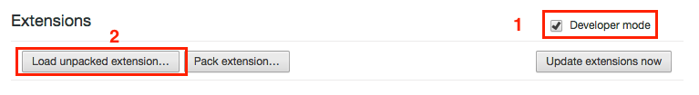
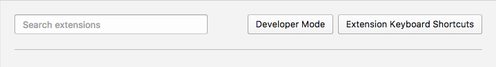

# Irvue-Helper-for-Chrome

Chrome extension which allows to add channels to Irvue from Unsplash

## How to install

First, you need to get latest version of the extension. You get it [here](/releases). Download `.zip` file and extract archive.

### Chrome

1. Open [chrome://extensions](chrome://extensions)
2. Enable Developer mode
3. Press on "Load unpacked extension" and choose folder extracted from downloaded `.zip` archive.

### Opera 

1. Open [opera://extensions](opera://extensions)
2. Enable Developer mode  

3. Press on "Load unpacked extension" and choose folder extracted from downloaded `.zip` archive.  
